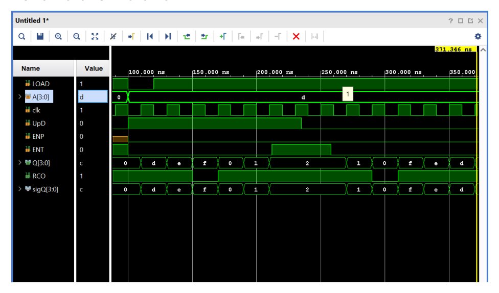
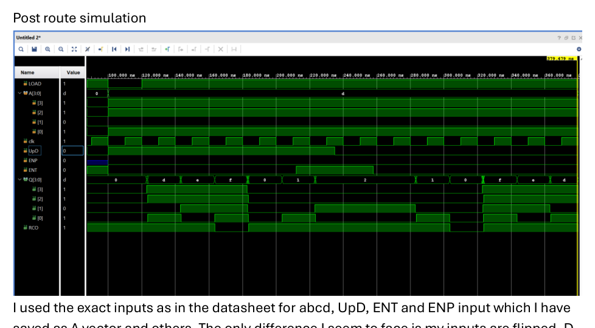
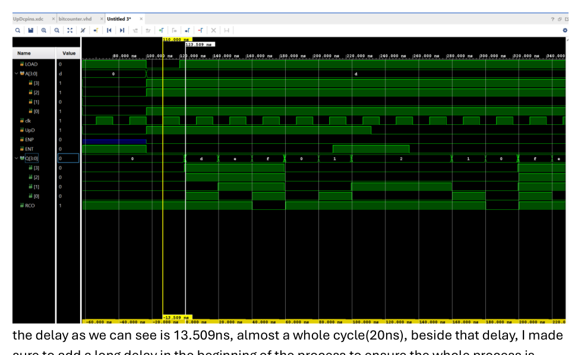
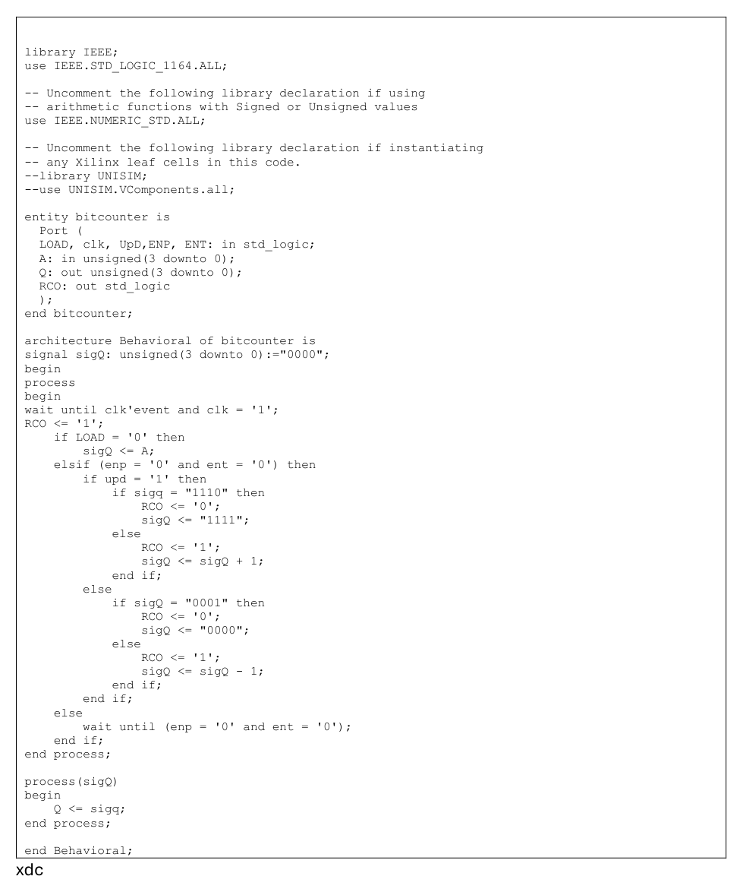
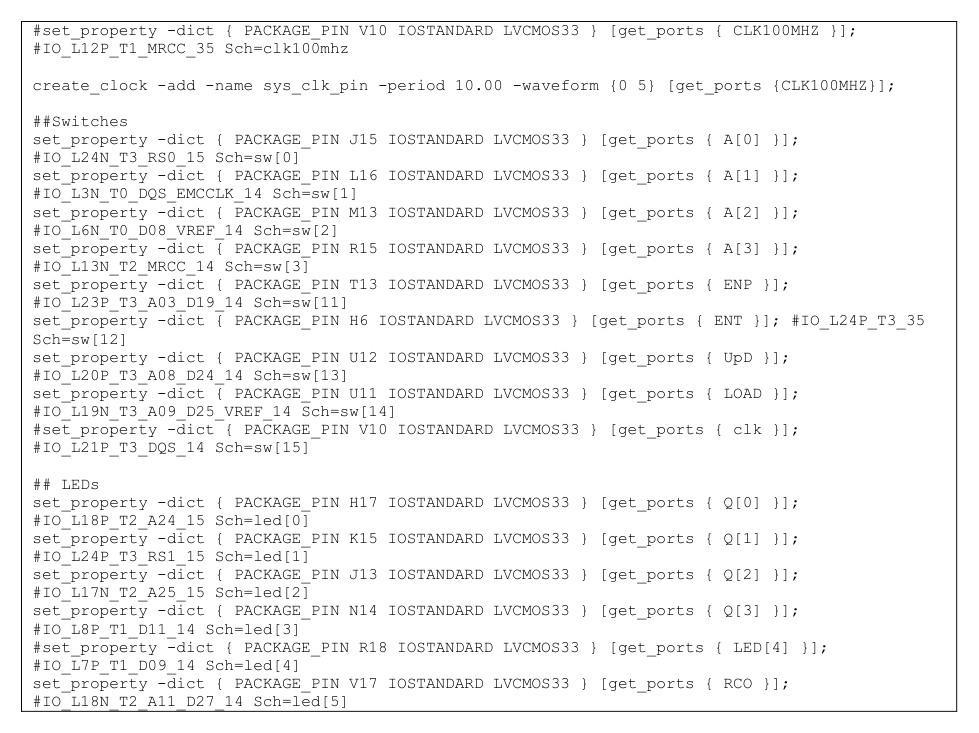

# SN74ALS169B Synchronous 4‑Bit Up/Down Counter (VHDL)

Vivado build of a **SN74ALS169B‑equivalent**: a synchronous 4‑bit **up/down** counter with **parallel load** and **terminal count / ripple carry out (RCO)**, implemented in VHDL for the Nexys A7 (Artix‑7).  
Verification is done in **behavioral** and **post‑route** simulation using a Tcl force script that follows the datasheet timing diagram.

---

## What’s implemented

- 4‑bit counter output `Q[3:0]`
- Parallel load from `A[3:0]` when `LOAD` is asserted
- Up/down counting via `UpD`
- Enable gating via `ENP` / `ENT`
- `RCO` behavior at the terminal count edges

---

## Code snippet (core counter process)

This is the main idea: on every rising edge of `clk`, either **load**, **count up**, or **count down**, and drive `RCO` near the terminal edges.

```vhdl
wait until clk'event and clk = '1';
RCO <= '1';

if LOAD = '0' then
  sigQ <= A;

elsif (ENP = '0' and ENT = '0') then
  if UpD = '1' then
    if sigQ = "1110" then
      RCO <= '0';
      sigQ <= "1111";
    else
      sigQ <= sigQ + 1;
    end if;
  else
    if sigQ = "0001" then
      RCO <= '0';
      sigQ <= "0000";
    else
      sigQ <= sigQ - 1;
    end if;
  end if;

else
  wait until (ENP = '0' and ENT = '0');
end if;
```

---

## Simulation (Tcl forcing)

The force script follows the datasheet-style sequence (load a value, enable, run for multiple cycles, flip `UpD`, toggle enables, etc.).  
One detail from the run: the post-route sim shows a **~13.509 ns delay** before `Q` updates — basically most of a 20 ns clock period.

```tcl
restart
add_force clk {0 0ns} {1 10ns} -repeat_every 20ns
add_force LOAD {1 0ns}
add_force A {0000 0ns}
add_force UpD {0 0ns}
add_force ENT {1 0ns}
run 100ns

add_force LOAD {0 0ns}
add_force A {1101 0ns}
add_force UpD {1 0ns}
add_force ENT {0 0ns}
add_force ENP {0 0ns}
run 20ns

add_force LOAD {1 0ns}
run 92ns
add_force ENT {1 0ns}
run 23ns
add_force UpD {0 0ns}
run 23ns
add_force ENT {0 0ns}
run 122ns
```

---

## Nexys A7 switch / LED mapping (from the XDC)

Inputs on switches:
- `A[3:0]` → `SW0..SW3`
- `ENP` → `SW11`
- `ENT` → `SW12`
- `UpD` → `SW13`
- `LOAD` → `SW14`

Outputs on LEDs:
- `Q[3:0]` → `LED0..LED3`
- `RCO` → `LED5`

Clock:
- Use the on-board `CLK100MHZ` as the design clock.

---

## Screenshots

### Behavioral simulation


### Post‑route simulation


### Delay measurement (cursor shows ~13.509 ns)


### Tcl force script (screenshot)


### VHDL source


### XDC pin mapping


## Demo video
I also have a video uploaded above showing the project functioning.
